# 📘 AI IDS: Intelligent Intrusion Detection System
> **Comprehensive Project Documentation**

---

## 📖 Table of Contents
1. [Project Overview](#-project-overview)
2. [How It Works (The "Brain")](#-how-it-works-architecture)
3. [Deep Dive: Features & Implementation](#-deep-dive-features--implementation)
4. [Visual Logic Flowcharts](#-visual-logic-flowcharts)
5. [Code Reference: Function Documentation](#-code-reference-function-documentation)
6. [Installation & Setup](#-installation--setup)

---

## 🔭 Project Overview

**What is this project?**
The **AI IDS** is a cybersecurity sentinel that sits on your network. It doesn't just "look" at traffic; it **understands** it. By combining traditional packet sniffing with a trained **Machine Learning Model**, it can distinguish between a harmless user browsing the web and a hacker scanning your ports.

**Why was it built?**
To demonstrate how AI can automate cyber defense. Instead of writing thousands of manual rules (e.g., "block port 8080"), we trained an AI model to recognize *patterns* of bad behavior.

---

## 🧠 How It Works (Architecture)

The system is like a security guard building with multiple departments. Here is the high-level layout:

```mermaid
graph TD
    %% Nodes
    User([👤 User / Admin])
    Attacker([🕷️ Attacker])
    
    subgraph "🛡️ Secure Zone (The AI IDS)"
        UI[🖥️ Dashboard UI]
        Server[⚙️ Flask Core]
        DB[(🗄️ Database)]
        
        subgraph "Detectors"
            Sniffer[📡 Network Sniffer]
            ML[🧠 AI Model]
            Phish[🎣 Phishing Module]
        end
    end

    %% Connections
    User ==>|Login & View Logs| UI
    Attacker -.->|Scans & Hacks| Sniffer
    Attacker -.->|Visits Fake Login| UI
    
    UI -->|Requests| Server
    Server <-->|Reads/Writes| DB
    
    Sniffer -->|Extracts Data| ML
    ML -->|Verdict: Safe/Danger?| Server
```



---

## 🔍 Deep Dive: Features & Implementation

Here is every functional component, explained simply with its code implementation.

### 1. AI Network Sniffer (The Watchdog)
**What it does:**  
Continuously listens to Wi-Fi/Ethernet signals. It grabs every "packet" (digital letter) passing through your computer.

**How we implemented it:**  
We use a library called **Scapy**. We don't analyze packet-by-packet (because that's too noisy). Instead, we group them into **Flows** (conversations).
*   *Code File:* `sniffer.py`
*   *Key Logic:* We count how many times an IP connects, how many bytes are sent, and the duration. Then we ask the AI model: *"Does this conversation look normal?"*

### 2. Phishing Detector (The Shield)
**What it does:**  
Checks if a website link (URL) is safe or a trap.

**How we implemented it:**  
We don't just blacklist sites. We analyze the *grammar* of the URL.
*   *Code File:* `phishing.py`
*   *Feature Checklist:*
    *   ❌ Is it using an IP address instead of a name? (e.g., `http://192.168.x.x`)
    *   ❌ Is the URL incredibly long?
    *   ❌ Does it use tricks like `g00gle.com` (Typosquatting)?
    *   ❌ Does it use a URL shortener?

### 3. Honeypot Trap (The Decoy)
**What it does:**  
A fake "Admin Login" page that serves no real purpose other than to catch hackers.

**How we implemented it:**  
*   *Code File:* `app.py` (Route: `/honeypot`)
*   *The Trap:* If anyone tries to log in here, we instantly record their IP.
*   *Advanced Detection:* We check the password field for SQL Injection attacks (e.g., `' OR '1'='1`). If found, we flag it as a critical "SQL Injection" attempt.

### 4. Attack Simulator (The Training Ground)
**What it does:**  
Since we can't wait for a real hacker to test the system, we built a button to **attack ourselves** safely.

**How we implemented it:**  
*   *Code File:* `attack_sim.py`
*   *Simulation:*
    *   **Port Scan**: It tries to connect to 10 different ports on your own computer rapidly. The Sniffer detects this "burst" of activity.
    *   **Brute Force**: It automatically types random passwords into the Honeypot to trigger alerts.

---

## 📐 Visual Logic Flowcharts

### A. The "Intrusion Detection" Decision Process
This is what happens inside the AI's brain when a packet arrives.

```mermaid
flowchart LR
    Start(Packet Received) --> Extract[Extract Features]
    Extract --> Checks{Heuristic Check?}
    
    Checks -- "High Frequency?" --> Danger[🚨 ALERT: Port Scan]
    Checks -- "Normal Rate" --> AI[🧠 Ask AI Model]
    
    AI -- "Prediction: 1" --> Intrusion[🚨 ALERT: Intrusion]
    AI -- "Prediction: 0" --> Safe[✅ Log: Normal Traffic]
    
    Intrusion --> DB[(Save to DB)]
    Safe --> DB
    Danger --> DB
```



### B. The "Phishing Check" Logic
How the system decides if a URL is malicious.

```mermaid
flowchart TD
    Input[User Enters URL] --> Length{Length > 75?}
    Length -- Yes --> Bad[Wait... Score +20]
    Length -- No --> IP{Contains IP?}
    
    IP -- Yes --> Bad2[Score +30]
    IP -- No --> Key{Bad Keywords?}
    
    Key -- "banking, update..." --> Bad3[Score +25]
    Key -- None --> Calc[Calculate Total Score]
    
    Calc -- "Score > 50" --> Phish[🔴 RESULT: PHISHING]
    Calc -- "Score < 50" --> Safe[🟢 RESULT: SAFE]
```



---

## 🛠 Code Reference: Function Documentation

A detailed breakdown of every key method used in this project.

### 1. Flask Application (`app.py`)
The web server logic.

| Function | Description |
| :--- | :--- |
| `login_required(f)` | **Decorator**. Checks if a user is logged in before accessing a page. If not, redirects to `/login`. |
| `start_sniffer()` | Initializes the background thread that runs the `PacketSniffer`. Ensures the detector runs 24/7 without blocking the website. |
| `honeypot()` | **Route: `/honeypot`**. Renders the decoy login page. Checks POST requests for SQL Injection patterns (e.g., `' OR 1=1`) and logs incidents. |
| `predict()` | **Route: `/predict`**. The manual analysis endpoint. It takes form input (41 features), pre-processes it, and queries the `.pkl` ML model for a result. |
| `live_data()` | **API Endpoint**. Fetches the latest logs from the database and returns them as JSON. Used by the Dashboard JavaScript for real-time updates. |

### 2. Network Sniffer (`sniffer.py`)
The packet capturing engine.

| Method | Description |
| :--- | :--- |
| `PacketSniffer.start()` | Auto-detects the active Wi-Fi/Ethernet interface and begins capturing packets using `scapy.sniff()`. |
| `get_flow_key(packet)` | Generates a unique Tuple ID for a connection `(src_ip, dst_ip, src_port, dst_port, protocol)`. Used to track sessions. |
| `extract_features(packet, flow)` | The most complex function. It calculates statistics like `duration`, `src_bytes`, and `srv_count` (service count) required by the KDD 99 ML model. |
| `process_packet(packet)` | Callback function for every new packet. Updates flow stats, runs the ML prediction, and inserts the verdict into the Database. |

### 3. Phishing Detector (`phishing.py`)
URL analysis logic.

| Function | Description |
| :--- | :--- |
| `extract_features(url)` | Deconstructs a URL string into a dictionary of indicators. Checks for IP address usage, length, "@" symbols, and port numbers. |
| `predict_phishing(url)` | **The Decision Maker**. Takes features from the function above and applies a scoring system. If the total "Risk Score" > 50, it marks the URL as Phishing. |

### 4. Attack Simulator (`attack_sim.py`)
Educational tools to trigger alerts.

| Function | Description |
| :--- | :--- |
| `simulate_brute_force(url)` | Sends repeated login POST requests to the target URL with random passwords to verify if the server logs "Failed Attempts". |
| `simulate_port_scan(ip)` | Attempts to open TCP connections to common ports (21, 22, 80, 443) on localhost in rapid succession to trigger the Sniffer's heuristic alarm. |
| `simulate_sql_injection(url)` | Sends classic SQL payloads (like `' UNION SELECT`) to testing endpoints to verify if the input sanitizer is working. |

### 5. Database Manager (`database.py`)
SQLite storage handler.

| Function | Description |
| :--- | :--- |
| `init_db()` | Creates the `ids_logs.db` file and the necessary tables (`logs`, `users`) if they don't exist. |
| `insert_log(entry)` | Saves a new alert or event to the database. Thread-safe to prevent errors when Sniffer and Web Server write simultaneously. |
| `get_recent_logs(limit)` | Retrieves the last N events, sorted by time. Used by the Dashboard to show recent activity. |

---

## 🚀 Installation & Setup

Want to run this yourself? Follow these simple steps.

1.  **Install Dependencies**
    We need Python libraries for the AI and Web Server.
    ```bash
    pip install -r requirements.txt
    ```

2.  **Start the Brain**
    Run the main application. This starts the Website AND the Sniffer.
    ```bash
    python app.py
    ```
    *(Note: You might need Administrator/Root privileges for the Sniffer to access the network card!)*

3.  **Open the Dashboard**
    Go to your browser:
    ➡️ `http://127.0.0.1:5001`
    
    *   **Login**: `admin`
    *   **Password**: `admin`

---
*Generated by AI IDS Team | 2026*
